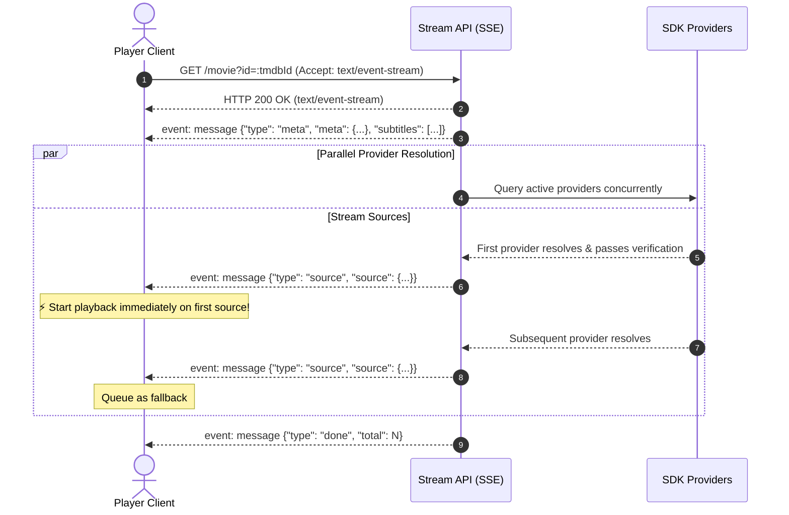
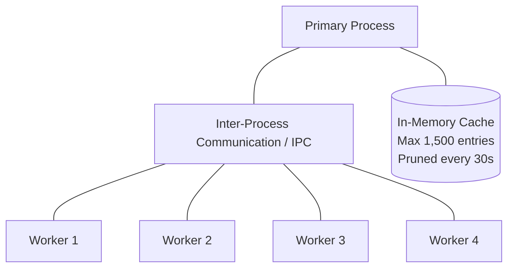

# Stream API

> An optional self-hosted HTTP and Server-Sent Events (SSE) layer built on top of Vyla SDK.

[](https://nodejs.org/)
[](#)
[](#)

---

## 📑 Table of Contents

- [Overview](#overview)
  - [When to Use](#when-to-use)
  - [Feature Matrix](#feature-matrix)
  - [Quick Start](#quick-start)
  - [Playback Request Lifecycle](#playback-request-lifecycle)
- [API Reference: Playback Routes & Events](#api-reference-playback-routes--events)
  - [Endpoints](#endpoints)
  - [SSE Event Contract](#sse-event-contract)
  - [Client Implementation Rules](#client-implementation-rules)
  - [Client Example (JavaScript / Browser)](#client-example-javascript--browser)
- [API Reference: Subtitles & Downloads](#api-reference-subtitles--downloads)
  - [Subtitle Endpoints](#subtitle-endpoints)
  - [Download Endpoints](#download-endpoints)
  - [Request & Response Rules](#request--response-rules)
- [Operations: Health, Testing & Debugging](#operations-health-testing--debugging)
  - [Health Check](#health-check)
  - [Test a Specific Provider](#test-a-specific-provider)
  - [Debug Route](#debug-route)
  - [Production Checklist](#production-checklist)
- [Deployment & Self-Hosting](#deployment--self-hosting)
  - [System Requirements](#system-requirements)
  - [Environment Variables](#environment-variables)
  - [Installation & Execution](#installation--execution)
  - [Cluster Mode (Multi-worker Scaling)](#cluster-mode-multi-worker-scaling)
  - [Network & IP Considerations](#network--ip-considerations)
  - [Reverse Proxy & TLS Setup](#reverse-proxy--tls-setup)
  - [Deployment Verification](#deployment-verification)

---

## Overview

**Stream API** wraps the Vyla SDK behind a lightweight Node.js HTTP service. It is designed for browsers, mobile applications, or external microservices that need progressive playback candidates delivered over HTTP via Server-Sent Events (SSE).

The service accepts TMDB IDs, requests stream candidates from configured SDK providers in parallel, validates each candidate, and pushes usable sources to the client as soon as they become available.

```mermaid
flowchart LR
    Client([Client / Player])
    API[Stream API Node.js]
    TMDB[(TMDB API)]
    P1[Provider A]
    P2[Provider B]
    P3[Provider C]

    Client -->|1. GET /movie?id=... (SSE)| API
    API -->|Fetch Title Meta| TMDB
    API -->|meta event| Client
    API -.->|Query in parallel| P1
    API -.->|Query in parallel| P2
    API -.->|Query in parallel| P3
    P2 -- Verified Source --> API -->|source event| Client
    P1 -- Verified Source --> API -->|source event| Client
    API -->|done event| Client
```

### When to Use

> [!NOTE]
> **Use this service only when HTTP is the appropriate architectural boundary.**
> - Stream API is ideal when your client is a web browser, native mobile app, or external process.
> - **If your backend is already a Node.js application**, you do **not** need this HTTP service. Call `VylaSDK#getStream`, `getSubtitles`, and `getDownloads` directly to eliminate network hops and expose your own custom endpoints.

### Feature Matrix

| Capability | Endpoint Family | Description |
| :--- | :--- | :--- |
| **Progressive Playback** | `/movie`, `/tv` | Streams metadata and verified video source candidates via Server-Sent Events (SSE). |
| **Supplemental Media** | `/subtitles`, `/downloads` | Fetches subtitle tracks or direct downloadable candidate links separately via JSON. |
| **Operations** | `/health`, `/test`, `/debug` | Observes source availability, tests providers, and traces requests. |

### Quick Start

```bash
# 1. Clone the repository
git clone https://gitlab.com/vyla-entertainment/stream-api.git
cd stream-api

# 2. Install dependencies
npm install

# 3. Start the server
TMDB_API_KEY=your_tmdb_api_key node server.js
```

The server binds to `http://localhost:7860` by default.

---

### Playback Request Lifecycle



1. **Connection**: Client initiates an SSE connection to `/movie?id=:tmdbId` or `/tv?id=:tmdbId&season=:season&episode=:episode`.
2. **Metadata Push**: Server responds immediately with a `meta` event containing TMDB details and subtitle tracks.
3. **Parallel Discovery**: Configured SDK providers resolve sources concurrently in the background.
4. **Source Candidates**: As soon as a provider candidate passes verification, the server emits a `source` event.
5. **Completion**: A `done` event is emitted after all providers finish resolution or hit timeout thresholds.

> [!TIP]
> **Start playback on the first `source` event!** Never wait for the `done` event before initiating video playback. Store subsequent sources in a fallback queue in case the active stream drops.

---

## API Reference: Playback Routes & Events

### Endpoints

All playback routes support standard paths and `/api`-prefixed paths. Responses are streamed as `text/event-stream`.

| Media | Endpoint | Query Parameters | Response Type |
| :--- | :--- | :--- | :--- |
| **Movie** | `GET /movie`<br>`GET /api/movie` | `id` *(TMDB ID, required)* | `text/event-stream` |
| **TV Episode** | `GET /tv`<br>`GET /api/tv` | `id` *(TMDB ID, required)*<br>`season` *(number, required)*<br>`episode` *(number, required)* | `text/event-stream` |

#### Example Requests

```bash
# Stream Movie (e.g. The Dark Knight - TMDB ID: 155)
curl -N "http://localhost:7860/movie?id=155"

# Stream TV Episode (e.g. Breaking Bad S01E01 - TMDB ID: 1396)
curl -N "http://localhost:7860/tv?id=1396&season=1&episode=1"
```

---

### SSE Event Contract

Every SSE message is sent over `data:` as a JSON string. Parse each line with `JSON.parse(event.data)`.

#### 1. `meta` Event
Sent immediately prior to source resolution. Contains title metadata and any pre-resolved subtitle tracks.

```json
{
  "type": "meta",
  "meta": {
    "id": 155,
    "title": "The Dark Knight"
  },
  "subtitles": [
    {
      "label": "English",
      "file": "https://example.com/subtitles/en.vtt",
      "type": "vtt",
      "source": "v1"
    }
  ]
}
```

#### 2. `source` Event
Emitted once for each provider candidate that passes verification.

```json
{
  "type": "source",
  "source": {
    "source": "provider-key",
    "label": "Provider Name",
    "url": "http://localhost:7860/api?url=https%3A%2F%2Fupstream.cdn%2Fmanifest.m3u8"
  }
}
```

> [!NOTE]
> The `url` field is ready for playback in your media player (e.g., Hls.js, Video.js, or ExoPlayer).
> - When `PROXY_STREAMS=true`, HLS sources are proxied through the server to inject required upstream headers, CORS headers, and fetch segment keys.
> - Certain sources are configured to bypass proxying directly. Do not rely on file extensions alone to dictate playback logic.

#### 3. `done` Event
Sent when all source providers have either returned results, failed, or timed out.

```json
{
  "type": "done",
  "total": 3
}
```

> [!IMPORTANT]
> If `total: 0`, no playable sources were discovered for the request. The HTTP connection itself is successful (status code 200).

---

### Client Implementation Rules

1. **Fast Start**: Begin playback immediately when the first `source` event is received.
2. **Fallback Queue**: Append subsequent `source` events to a backup queue for automatic failover or manual stream switching.
3. **Subtitles**: Load subtitle tracks provided in the `meta` event asynchronously without delaying video playback.
4. **Empty Results**: Treat `{ "type": "done", "total": 0 }` as a standard product state ("No sources found"), not as a transport error.
5. **Connection Teardown**: Call `EventSource.close()` or abort the HTTP request as soon as the user navigates away or switches media.

---

### Client Example (JavaScript / Browser)

```javascript
function playMedia(tmdbId, season = null, episode = null) {
  const url = season && episode 
    ? `/api/tv?id=${tmdbId}&season=${season}&episode=${episode}`
    : `/api/movie?id=${tmdbId}`;

  const eventSource = new EventSource(url);
  const fallbackQueue = [];
  let isPlaying = false;

  eventSource.onmessage = (event) => {
    const data = JSON.parse(event.data);

    switch (data.type) {
      case 'meta':
        console.log('Title:', data.meta.title);
        loadSubtitles(data.subtitles);
        break;

      case 'source':
        if (!isPlaying) {
          isPlaying = true;
          startPlayer(data.source.url);
        } else {
          fallbackQueue.push(data.source);
        }
        break;

      case 'done':
        console.log(`Finished discovering sources. Total: ${data.total}`);
        if (!isPlaying && data.total === 0) {
          showNotification('No playable sources available.');
        }
        eventSource.close();
        break;
    }
  };

  eventSource.onerror = (err) => {
    console.error('SSE Stream error:', err);
    eventSource.close();
  };

  return () => eventSource.close(); // Cleanup / Abort handler
}
```

---

## API Reference: Subtitles & Downloads

These endpoints deliver static JSON responses instead of SSE streams.

### Subtitle Endpoints

| Media | Endpoint | Response |
| :--- | :--- | :--- |
| **Movie** | `GET /subtitles/movie/:id`<br>`GET /api/subtitles/movie/:id` | `application/json` |
| **TV Episode** | `GET /subtitles/tv/:id/:season/:episode`<br>`GET /api/subtitles/tv/:id/:season/:episode` | `application/json` |

#### Successful Response (`200 OK`)
```json
[
  {
    "label": "English",
    "file": "https://example.com/subtitles/en.vtt",
    "type": "vtt",
    "source": "v1"
  }
]
```

- `file`: Direct URL to the subtitle file (`.vtt` or `.srt`).
- `source`: Upstream provider identifier.

> [!TIP]
> If you are already opening an SSE stream via `/movie` or `/tv`, use the subtitles provided in the `meta` event rather than performing an extra HTTP request.

---

### Download Endpoints

| Media | Endpoint | Response |
| :--- | :--- | :--- |
| **Movie** | `GET /downloads/movie/:id`<br>`GET /api/downloads/movie/:id` | `application/json` |
| **TV Episode** | `GET /downloads/tv/:id/:season/:episode`<br>`GET /api/downloads/tv/:id/:season/:episode` | `application/json` |

#### Successful Response (`200 OK`)
```json
[
  {
    "url": "https://example.com/files/movie-1080p.mp4",
    "quality": "1080p",
    "size": "2.14 GB",
    "format": "MP4"
  }
]
```

> [!NOTE]
> Download URLs point to upstream provider resources and are **not** hosted persistently by Stream API.
> - An empty array `[]` indicates no download candidates were found.
> - `quality` and `size` are informational; links may expire based on upstream provider policies.

---

### Request & Response Rules

- Identifiers must be valid numeric **TMDB IDs**. TV endpoints strictly require `:season` and `:episode`.
- Status codes:
  - `200 OK`: Request succeeded.
  - `404 Not Found`: Media or subtitles not found.
  - `500 Internal Server Error`: Upstream resolver failure.
- Never block initial video playback waiting for subtitles or downloads. Fetch them in parallel or on demand.

---

## Operations: Health, Testing & Debugging

### Health Check

```http
GET /health
GET /api/health
```

Probes active provider endpoints and returns system metrics, cache statistics, and provider latencies.

#### Example Response
```json
{
  "status": "ok",
  "timestamp": "2026-10-05T03:26:10.000Z",
  "tmdbKeyConfigured": true,
  "cacheSize": 42,
  "providers": {
    "provider-alpha": { "ok": true, "ms": 230 },
    "provider-beta": { "ok": false, "ms": 1500 }
  }
}
```

> [!WARNING]
> Health check results indicate reachability, not a 100% guarantee of playback. Individual stream success depends on title availability, geo-restrictions, and network conditions.

---

### Test a Specific Provider

Test whether a single provider resolves a given title without streaming the full SSE lifecycle:

```bash
# Test movie resolution for a specific provider
curl "http://localhost:7860/test/155?source=provider-key"

# Test TV episode resolution
curl "http://localhost:7860/test/1396?season=1&episode=1&source=provider-key"
```

Also supported under `/api/test/:id`. The query parameter `s` and `e` can be used as shorthand aliases for `season` and `episode`.

---

### Debug Route

Inspect upstream candidate resolution, raw URLs, and HTTP headers:

```http
GET /debug/:id?source=provider-key
GET /api/debug/:id?source=provider-key
```

> [!CAUTION]
> The debug route is only accessible when `ENABLE_DEBUG_ROUTE=true` in `.env`.
> **Never enable this route on a public or production instance**, as it exposes raw upstream headers and provider URLs. Use only in isolated local troubleshooting environments.

---

### Production Checklist

- [ ] **TMDB API Key**: Ensure `TMDB_API_KEY` is configured for title matching and metadata validation.
- [ ] **Debug Route Disabled**: Ensure `ENABLE_DEBUG_ROUTE=false` is set in production.
- [ ] **Reverse Proxy & TLS**: Terminate SSL/TLS (HTTPS) using Caddy, Nginx, or Cloudflare Tunnel.
- [ ] **Fallback Strategy**: Configure the player client to retain a queue of alternative stream candidates.
- [ ] **Observability**: Set up automated monitoring on `/health` to track provider uptime and latency trends.

---

## Deployment & Self-Hosting

Stream API is a self-hosted Node.js application intended to run on infrastructure you own and operate. It does not require an external database and manages an in-memory cache internally.

### System Requirements

- **Node.js**: v18.0.0 or later
- **TMDB API Key**: Required for ID validation, anime routing, and metadata retrieval.

---

### Environment Variables

Configure application settings by creating a `.env` file in the project root:

```env
# Server
PORT=7860
WORKER_COUNT=1

# Integrations
TMDB_API_KEY=your_tmdb_api_key_here

# Proxying & Debugging
ENABLE_DEBUG_ROUTE=false
PROXY_STREAMS=false
PROXY_URL=

# Optional Telemetry
GA_MEASUREMENT_ID=
GA_API_SECRET=
```

#### Variable Reference

| Variable | Required | Default | Description |
| :--- | :---: | :---: | :--- |
| `TMDB_API_KEY` | **Yes** | — | TMDB API key. Powers title validation, metadata lookups, and anime detection. |
| `PORT` | No | `7860` | HTTP listening port for the server. |
| `WORKER_COUNT` | No | `1` | Number of Node.js cluster worker processes to spawn. |
| `ENABLE_DEBUG_ROUTE` | No | `false` | Enables `/debug/:id` and `/api/debug/:id`. Keep `false` in production. |
| `PROXY_STREAMS` | No | `false` | Proxies video stream segments and playlists through `/api?url=...`. |
| `PROXY_URL` | No | — | External base proxy URL. Used when `PROXY_STREAMS=true`. |
| `GA_MEASUREMENT_ID` | No | — | Google Analytics 4 Measurement ID. |
| `GA_API_SECRET` | No | — | Google Analytics 4 API secret token. |

---

### Installation & Execution

```bash
# Clone repository
git clone https://gitlab.com/vyla-entertainment/stream-api.git
cd stream-api

# Install dependencies
npm install

# Start single process
node server.js
```

---

### Cluster Mode (Multi-worker Scaling)

Stream API includes built-in multi-process clustering via Node's `cluster` module.

```bash
WORKER_COUNT=4 node server.js
```



- **Shared Cache**: The primary process manages a centralized in-memory cache (maximum 1,500 entries, pruned every 30 seconds).
- **Zero Cache Duplication**: Worker processes query and write cache entries over IPC, ensuring deduplicated requests across all workers.
- **Worker Independence**: Each worker independently loads provider modules and handles outbound HTTP/SSE client connections.

---

### Network & IP Considerations

> [!WARNING]
> Many streaming providers block datacenter IP addresses (e.g., AWS, GCP, DigitalOcean, Hetzner, OVH).
> 
> - If `getStream` fails on cloud VPS instances but functions on your local machine, upstream providers have likely restricted the datacenter IP range.
> - **Recommendation**: Deploy on a residential network or route outbound requests through residential proxies.

---

### Reverse Proxy & TLS Setup

Stream API runs unencrypted over plain HTTP. In production, place it behind a reverse proxy to terminate TLS (HTTPS).

#### CORS
CORS is enabled by default in the application layer:
```http
Access-Control-Allow-Origin: *
```
No additional CORS configuration is required on your reverse proxy.

#### Example: Caddyfile
```caddy
stream.yourdomain.com {
    reverse_proxy localhost:7860 {
        # Enable streaming support for SSE
        flush_interval -1
    }
}
```

#### Example: Nginx
```nginx
server {
    listen 443 ssl http2;
    server_name stream.yourdomain.com;

    ssl_certificate /etc/letsencrypt/live/stream.yourdomain.com/fullchain.pem;
    ssl_certificate_key /etc/letsencrypt/live/stream.yourdomain.com/privkey.pem;

    location / {
        proxy_pass http://127.0.0.1:7860;
        proxy_http_version 1.1;

        # SSE Buffering configuration
        proxy_set_header Connection '';
        proxy_buffering off;
        proxy_cache off;
        chunked_transfer_encoding off;

        proxy_set_header Host $host;
        proxy_set_header X-Real-IP $remote_addr;
        proxy_set_header X-Forwarded-For $proxy_add_x_forwarded_for;
        proxy_set_header X-Forwarded-Proto $scheme;
    }
}
```

---

### Deployment Verification

Verify your deployment step-by-step:

1. **Verify Health**:
   ```bash
   curl http://localhost:7860/health
   ```
   Ensures the service is listening and lists source reachability.

2. **Verify Stream Resolution**:
   ```bash
   curl "http://localhost:7860/api/test/155?source=vidrock"
   ```
   Validates end-to-end resolution of a known title (The Dark Knight, TMDB `155`).

3. **Verify Debug Output (Local only)**:
   ```bash
   ENABLE_DEBUG_ROUTE=true node server.js
   curl "http://localhost:7860/api/debug/155?source=vidrock"
   ```
   Checks upstream request headers and raw candidate extraction. *Remember to set `ENABLE_DEBUG_ROUTE=false` before moving to production.*
